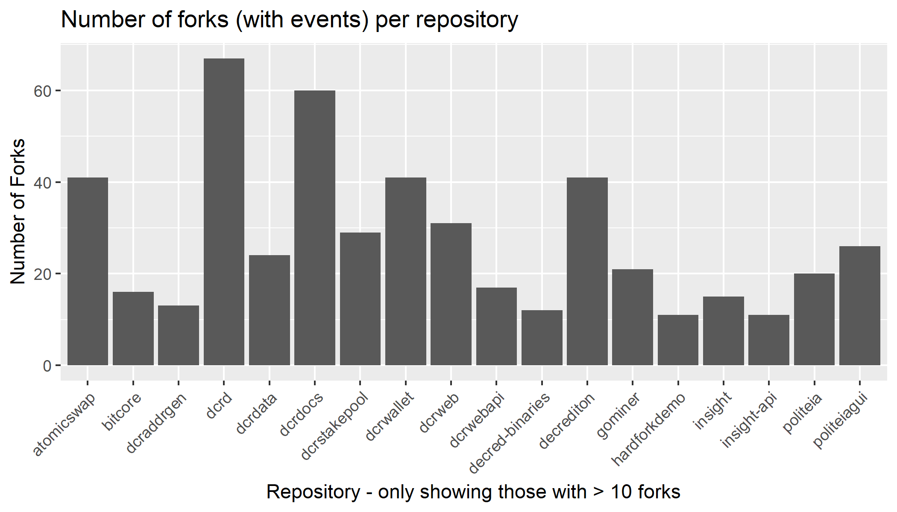
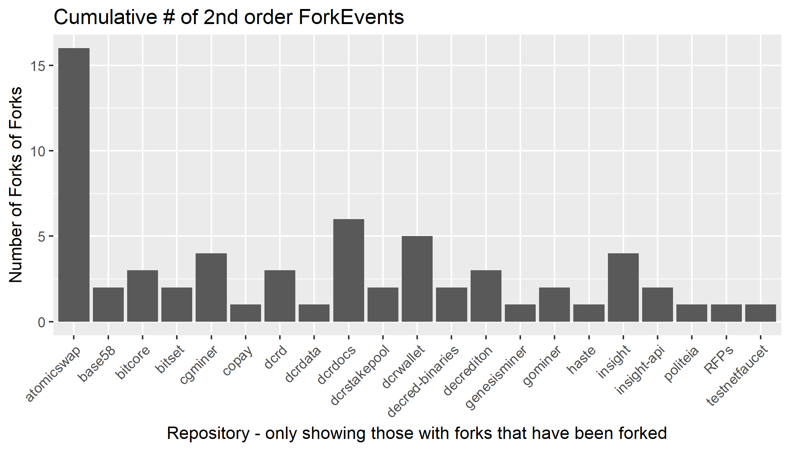
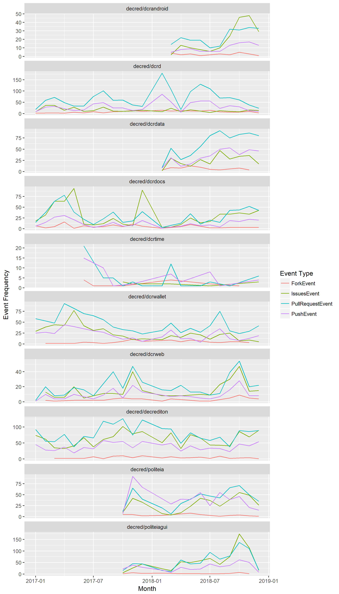
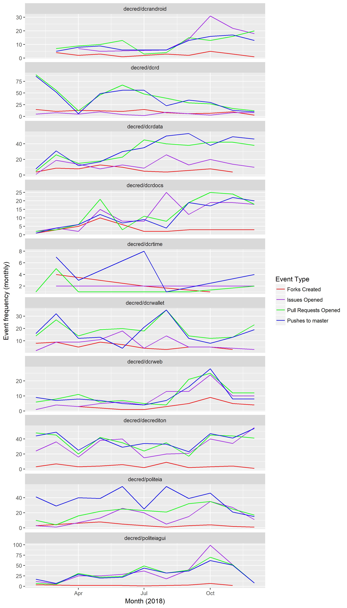

# github-bq

This repository contains code, graphs and analysis of GitHub event data extracted from the [githubarchive](https://www.gharchive.org/). It focuses on the repositories associated with the Decred cryptocurrency project.

## Repository fork analysis

This section considers repositories that were created on GitHub as forks of a /decred/ repository. Data were collected by first querying the yearly GitHub events tables to find every ForkEvent with target repo.name 'decred', then querying for all events associated with all of these forked repositories.

This method will only 'discover' forked repositories that were created through a GitHub ForkEvent. Developers may clone and fork from Decred's software without using this kind of event which makes the relationship obvious - for example if they do not use GitHub, or if they wanted to obfuscate the fact that the repository was cloned from a Decred repo.

In the data for 2015-2018, there were 1,573 ForkEvents, and 665 distinct forked repositories which went on to have their own events. The graph below shows the number of forks with events associated with Decred repositories, only showing those repositories with at least 10 forks.

Some of these forked repositories are created and used by Decred contributors - it is common for developers to work in their own fork of a repository and create Pull Requests to incorporate their changes back into the main branch which will be incorporated in future releases. 

Some forks are created by people who plan to use the software and develop it in their own direction, maintaining it independently of the original repository. Decred's dcrd repo was itself originally forked from the btcd Bitcoin node software produced by Company 0.

Forked repositories can be considered "internal" (they feed their changes back to the main repo) or "external" (they are developed independently of the main repo). Internal forks are an indication that development is occurring in the original/primary repository for the software, external forks are an indication that the software is being used elsewhere. 

The distinction between "external" and "internal" forks is not clear-cut because external forks may still feed back some improvements to their origin repository, for example through Pull Requests. It seems like a useful distinction to make however when considering how a fork relates to its parent repository, and what its significance is.  

## "Externally" maintained forks

It is difficult to operationalize the concept of an internal/external fork. For simplicity's sake I have defined "external" forks as forks which are themselves subsequently forked, indicating that they may serve as an additional hub for development through the fork and pull request workflow. This crude indicator suggests that forks of Decred repositories have themselves been forked 56 times.

This method of classification is not great, because many of the forks of forks are not "external" projects at all, but contributors to "internal" repositories helping each other out in their own branches directly. The method does however identify the [atomicswap](https://github.com/decred/atomicswap) repository as being worth a look.

This [csv file](data/atomicswap-forks.csv) lists the forks of the atomicswap repository and the number of events of certain types which they had. Within this list one can see that the atomicswap repo has been forked and used [by](https://github.com/viacoin/atomicswap) [a](https://github.com/qtumproject/atomicswap) [number](https://github.com/bitcoin-atom/atomicswap) [of](https://github.com/zcoinofficial/atomicswap) [other](https://github.com/vertcoin-project/atomicswap) [projects](https://github.com/particl/atomicswap).   Ultimately however, it is difficult to place any solid interpretation on the number of any particular kind of GitHub event.

## Problems with interpreting GitHub events and using these ro rank projects.

One of the aims of collecting and analyzing this data was to look for ways to [gain insight into contributions to Decred's repositories](https://proposals.decred.org/proposals/5d9cfb07aefb338ba1b74f97de16ee651beabc851c7f2b5f790bd88aea23b3cb/comments/34). I have encountered problems associated with doing this in a meaningful way without digging into the underlying code. It is worth considering some of these briefly, as this kind of method underpins several sites which score and rank cryptocurrencies by their development activity. When these metrics are used to measure progress or health, it creates an incentive for the developers working on those projects to adapt their behavior to present more favorable stats.

* Number of PushEvents or commits. On the surface, one might assume that a greater number of pushes/commits to the codebase reflects a greater level of activity. However, the size of a commit is arbitrary and depends on the habit/practice of the developers making the commits - the same task could be completed in 1 commit or 100 commits, with the number of commits reflecting something more like how often they save their work. Number of commits can be easily inflated by, for example, correcting typos in individual commits.
* Commits can also be considered based on their size, how much code they add or remove. Adding more code is not always a positive, as it creates more opportunity for things to go wrong. The count of additions and deletions could also be easily gamed by churning the code, removing things in one commit then adding them back in another one. Number of characters added/removed also gives no insight into whether the code being added/removed is of high quality and has been sufficiently tested.
* Number of Pull Requests has the same problems as looking at the number of Pushes or commits, the size of a PR is arbitrary.
* Number of Forks/Watchers/Stars may give some insight into how popular a repository is with developers, more would tend to be better but the numbers can be easily gamed by creating sockpuppet GitHub accounts. Using these numbers to rank projects by developer interest creates an incentive to inflate them.
* The number of distinct users who have contributed to a repository is an interesting metric, especially for decentralized projects which aim to avoid over-reliance on specific individuals. There are a couple of ways to define this: 1) users who commit code or merge PRs to the main branch, or 2) any user who contributes code that is merged to the main branch (i.e. through PRs). The first gives insight into how many people have permission and responsibility for deciding when changes are accepted to the code in the main branch and incorporated into releases - it reflects how production is organized and operational security concerns about the repository being compromised by an attacker. The second gives an indication of how many people are submitting any kind of code which makes it into the main branch, but does not differentiate between minor contributions to peripheral aspects like tests, and substantive contributions to key components. Number of distinct contributors could also be gamed by encouraging small contributions from fresh identities. 

As all quantitative metrics based on git or GitHub activity are easily gamed, I see little value in developing ways of ranking or scoring projects using these metrics. This may in fact be counterproductive, as any perception that these metrics matter could easily affect the behavior of contributors and distort the data, diminishing its utility.

#### Making good use of git and GitHub data

Resources like the GitHub archive and the commit histories of the repositories themselves capture a detailed history of how the software has been constructed. It is possible to know exactly where any given piece of code came from and who wrote it. It is however difficult to aggregate the data in ways which are meaningful across projects. 

The degree to which the  

* that the "size" of an individual commit or PR within a particular repository is somewhat standardized, or at least normally distributed. 
* that it is not being artificially inflated by the people whose activity it represents - if workers believed they were being assessed based on their number of commits, they would likely make more regular and smaller commits.

With these assumptions, looking at activity levels over time would yield some insight into the level of effort being expounded in different repositories. Looking at this data at the individual contributor level would also allow us to see roughly how people are distributing their effort between different repositories, and when they shift focus from one project to another. 

I have hesitated to look at the contributor level data in any detail because it feels a bit too much like surveillance for my taste. I also don't see any particular value in producing contributor-level statistics or graphs because as noted above, any significant use of these metrics would see them being gamed. I would like to hear perspectives on whether this line of enquiry is worth pursuing, my feeling is that it is not.

Here are some rough graphs showing event counts by month for a selection of 10 Decred repositories:

What can the above graph tell us (upon zooming in)?

* When work began in repositories (or when they were migrated to the /decred/ organization).
* When work was not occurring in a repository. For example activity in the dcrtime repo dropped off sharply after it appeared initially, and there have been several months with no pushes. For most of the repositories in this graph though work (as quantified by number of Push or PR events) continued fairly steadily from month to month, with the occasional big month. 
* The ratio of IssueEvents to PushEvents and PullRequestEvents is fairly stable within repositories. Repositories like dcrd and dcrwallet see few Issues, while repositories like decrediton and politeia have more Issue activity than PushEvents or PullRequestEvents.  

The raw event counts can be tidied up by isolating specific types of event, for example to only consider Pull Request openings or merges. The graph below isolates Pull Request openings and Pushes to master branch (for 2018 only). These follow each other closely for most repositories, indicating that pushes to the master branch are probably always PR merges. 

## Current status of this repository/project

This project is not being actively worked on. Due to the limitations of this data outlined above, and the level of effort required to make any meaningful progress, it seems for now like this effort would be better spent elsewhere. 